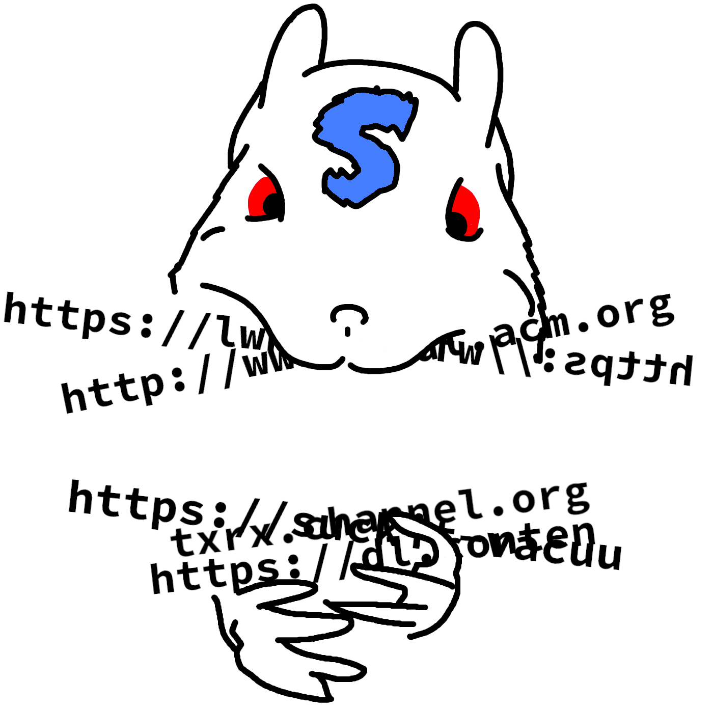

# SuckIT

`SuckIT` allows you to recursively visit and download a website's content to
your disk.

# Features

* [x] Vacuums the entirety of a website recursively
* [x] Uses multithreading
* [x] Writes the website's content to your disk
* [x] Enables offline navigation
* [ ] Saves application state on CTRL-C for later pickup
* [ ] Offers random delays to avoid IP banning

# Options

|Option|Behavior|
|---|---|
|`-h, --help`|Displays help information|
|`-v, --verbose`|Activate Verbose output|
|`-d, --depth`|Specify the level of depth to go to when visiting the website|
|`-j, --jobs`|Number of threads to use|
|`-o, --output`|Output directory where the downloaded files are written|
|`-t, --tries`|Number of times to retry when the downloading of a page fails|

# Example

A common use case could be the following:

`suckit http://books.toscrape.com -j 8 -o /path/to/downloaded/pages/`

__Want to contribute ? Feel free to
[open an issue](https://github.com/Skallwar/suckit/issues/new) or
[submit a PR](https://github.com/Skallwar/suckit/compare) !__
